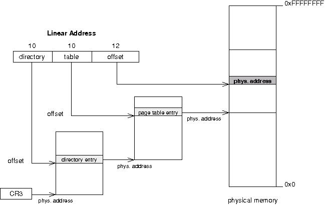

# Chapter 8: Theory: physical and virtual memory

In the chapter related to the GDT, we saw that using segmentation a physical memory address is calculated using a segment selector and an offset.

In this chapter, we are going to implement paging, paging will translate a linear address from segmentation into a physical address.

## Why do we need paging?

Paging will allow our kernel to:

* use the hard-drive as a memory and not be limited by the machine ram memory limit
* to have a unique memory space for each process
* to allow and unallow memory space in a dynamic way

In a paged system, each process may execute in its own 4gb area of memory, without any chance of effecting any other process's memory, or the kernel's. It simplifies multitasking.


## How does it work?

The translation of a linear address to a physical address is done in multiple steps:

1. The processor use the registry `CR3` to know the physical address of the pages directory.
2. The first 10 bits of the linear address represent an offset \(between 0 and 1023\), pointing to an entry in the pages directory. This entry contains the physical address of a pages table.
3. the next 10 bits of the linear address represent an offset, pointing to an entry in the pages table. This entry is pointing to a 4ko page.
4. The last 12 bits of the linear address represent an offset \(between 0 and 4095\), which indicates the position in the 4ko page.



## Format for pages table and directory

The two types of entries \(table and directory\) look like the same. Only the field in gray will be used in our OS.


* `P`: indicate if the page or table is in physical memory
* `R/W`: indicate if the page or table is accessible in writting \(equals 1\)
* `U/S`: equals 1 to allow access to non-preferred tasks
* `A`: indicate if the page or table was accessed
* `D`: \(only for pages table\) indicate if the page was written
* `PS` \(only for pages directory\) indicate the size of pages:
  * 0 = 4kb
  * 1 = 4mb

**Note:** Physical addresses in the pages diretcory or pages table are written using 20 bits because these addresses are aligned on 4kb, so the last 12bits should be equal to 0.

* A pages directory or pages table used 1024\*4 = 4096 bytes = 4k
* A pages table can address 1024 \* 4k = 4 Mb
* A pages directory can address 1024  _\(1024_  4k\) = 4 Gb

## How to enable pagination?

To enable pagination, we just need to set bit 31 of the `CR0`registry to 1:

```text
asm("  mov %%cr0, %%eax; \
       or %1, %%eax;     \
       mov %%eax, %%cr0" \
       :: "i"(0x80000000));
```

But before, we need to initialize our pages directory with at least one pages table.

## Identity Mapping

With the identity mapping model, the page will apply only to the kernel as the first 4 MB of virtual memory coincide with the first 4 MB of physical memory:


This model is simple: the first virtual memory page coincide to the first page in physical memory, the second page coincide to the second page on physical memory and so on ...

